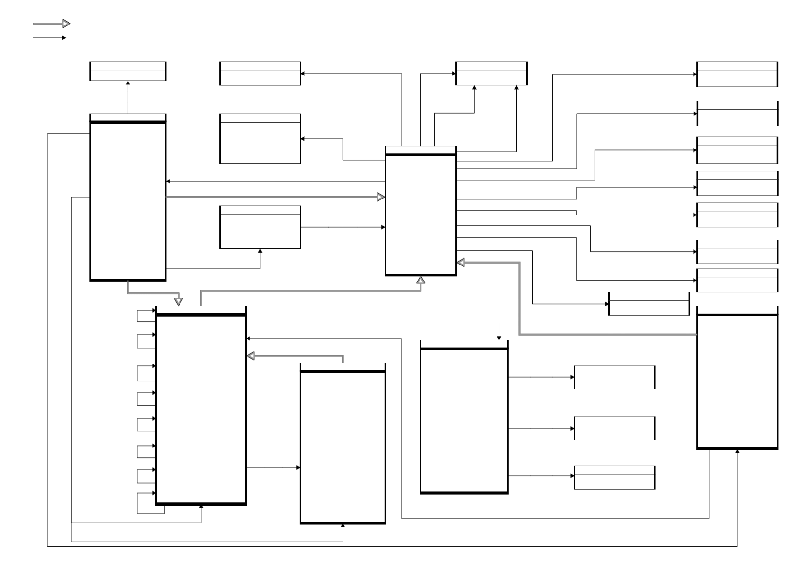

# DCAT-EP

This is the issue tracker for the maintenance of DCAT-EP.

DCAT-EP is an extension of the [DCAT Application Profile for European data portals](https://joinup.ec.europa.eu/solution/dcat-application-profile-data-portals-europe) (DCAT-AP), designed and used for documenting datasets and data services of the European Parliament.

## Versions

- Latest version:
  - [HTML](./index.html)
  - [SHACL](./dcat-ep.shacl.ttl)
- [Version 0.3](./0.3/)

## Documentation

Additional documentation on the use of DCAT-EP is available in folder [`docs/`](./docs/).

## DCAT-EP at a glance

## Licence

DCAT-EP is distributed under the terms and conditions described in the [European Parliament Legal Notice](https://www.europarl.europa.eu/legal-notice/).
