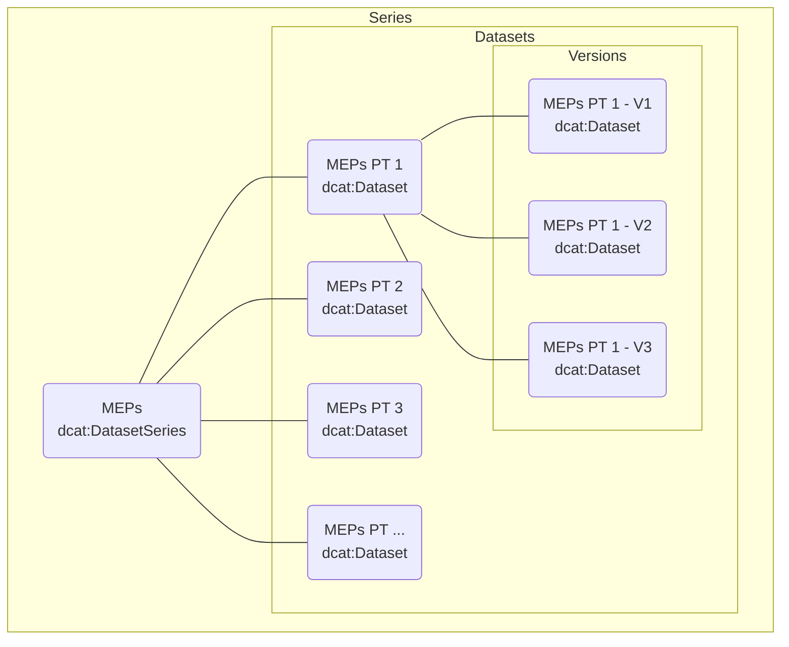
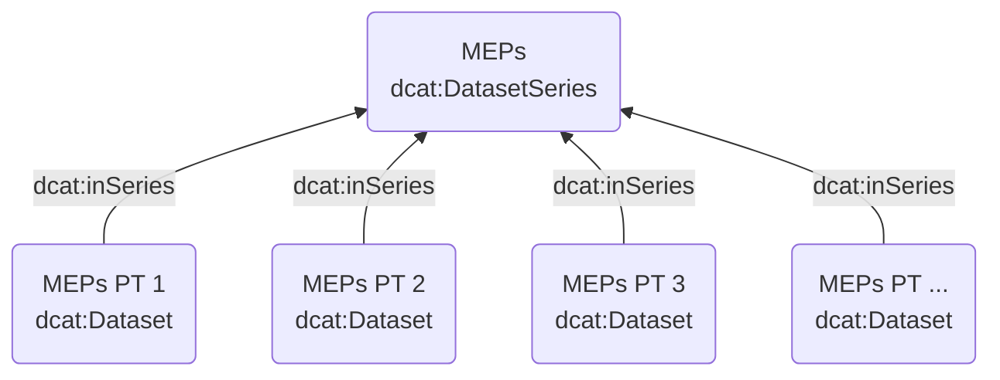
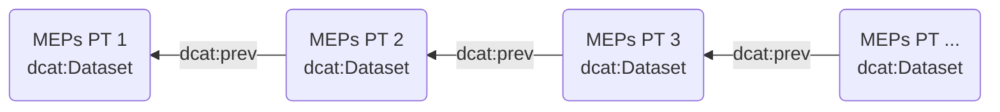
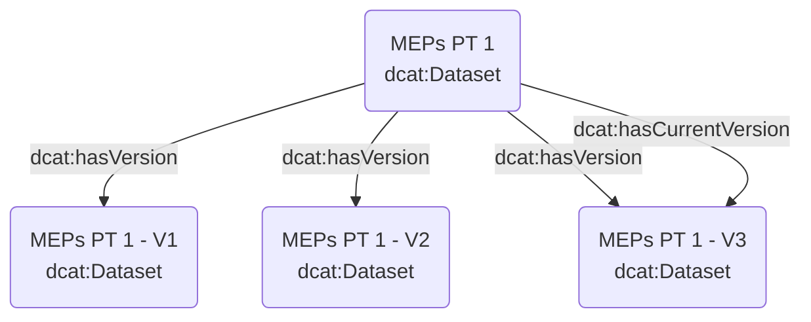
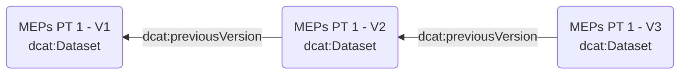

# Documentation on the use of DCAT-EP

## Datasets, series, and versions

In DCAT-EP, datasets are grouped into dataset series and dataset versions, following the approach defined in [[VOCAB-DCAT-3](https://www.w3.org/TR/vocab-dcat-3/)] - see, in particular, [§12. Dataset series](https://www.w3.org/TR/vocab-dcat-3/#dataset-series) and [§11. Versioning](https://www.w3.org/TR/vocab-dcat-3/#dataset-versions), respectively.

A dataset series groups datasets sharing similar characteristics. A typical case is datasets containing the same data but for different time periods. E.g., data about Members of the European Parliament (MEPs) are split into different datasets, each corresponding to a given Parliamentary Term (PT 1, PT 2, etc.). All these datasets are grouped into a series.

Dataset versions correspond to snapshots of the same dataset. E.g., the MEPs dataset of Parliamentary Term 1 (MEPs PT 1) may need to be updated to correct errors, when MEPs change their data, and/or whenever MEPs join or leave the EP during that Parliamentary Term. No assumption is made on how much frequently a new version is released, which depends on the data management workflow - e.g., the same day can see the release of more than one version.

The following diagram shows the general relationships between series, datasets, and versions, using the MEPs datasets as an example.

### Relationships between series and datasets

Datasets are linked to a series by using property `dcat:inSeries`, as shown in the following diagram:

Datasets in a series are linked by using property `dcat:prev` and, optionally, its inverse  `dcat:next`.

### Relationships between a dataset and its versions

A dataset is linked to its versions by using property `dcat:hasVersion` and, optionally, its inverse `dcat:isVersionOf`. The link between a dataset and its current version (typically, the latest) is specified by using property `dcat:hasCurrentVersion`.

Dataset versions are linked by using property `dcat:previousVersion` and, optionally, its inverse `dcat:nextVersion`.

# References

<dl>

<dt>[VOCAB-DCAT-3]</dt>
<dd><cite>Data Catalog Vocabulary (DCAT) - Version 3</cite>. Riccardo Albertoni; David Browning; Simon Cox; Alejandra Gonzalez Beltran; Andrea Perego; Peter Winstanley. W3C. 10 May 2022. W3C Working Draft. URL: <a href="https://www.w3.org/TR/vocab-dcat-3/">https://www.w3.org/TR/vocab-dcat-3/</a></dd>

</dl>
